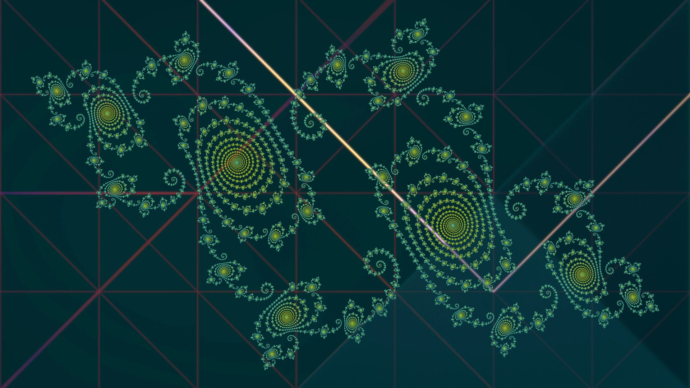
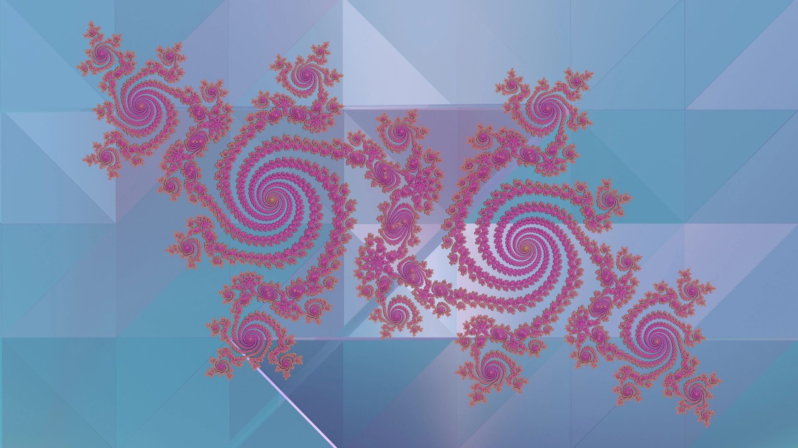
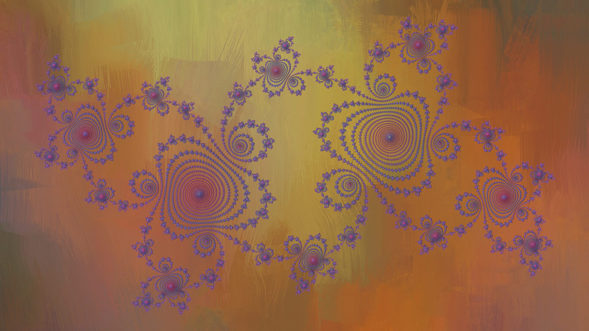

# wallswitch

Random Wallpaper for Multiple Monitors

```
#-----------#-----------# ... ... #-----------#
|           |           |         |           |
| Monitor 1 | Monitor 2 |         | Monitor n |
|           |           |         |           |
#-----------#-----------# ... ... #-----------#
```

### Description

`wallswitch` randomly selects and processes wallpapers for multiple monitors.

It is designed to be fast, and lightweight, performing all image stitching, cropping, scaling, and fractal generation in-process using pure Rust.

### Example Wallpapers (with Julia Fractal Overlays)

Below are 3 examples of generated wallpapers after applying the procedural Julia set fractal overlay effect.
Click on the thumbnails below to view the images in 1920x1080 resolution:

<table align="center" width="100%">
  <tr>
    <td align="center" width="33.3%">
      <a href="examples/wallswitch_monitor_0.jpg" target="_blank">
        
      </a>
      <br/>
      <em>Example 1</em>
    </td>
    <td align="center" width="33.3%">
      <a href="examples/wallswitch_monitor_1.jpg" target="_blank">
        
      </a>
      <br/>
      <em>Example 2</em>
    </td>
    <td align="center" width="33.3%">
      <a href="examples/wallswitch_monitor_2.jpg" target="_blank">
        
      </a>
      <br/>
      <em>Example 3</em>
    </td>
  </tr>
</table>

### Features

* **Multi-Picture Composition**: Dynamically combines up to N different wallpapers per monitor across all supported desktop environments.
* **Smart Caching & Visual Deduplication**:
    * Uses BLAKE3 hashing to index files.
    * Automatically skips visual duplicates (same image, different filename).
    * Smart cache checks modification times (mtime) for instant startup.
* **Procedural Overlay Effects**: Adds customizable mathematical overlays over your wallpapers. Configured via `-e / --effect <none|julia|mandelbrot|newton|nova|star|aurora|fractal|random>`:
    * **Julia Sets (`julia`)**: Detailed, randomized 360-degree rotated fractals. Uses continuous potential smooth coloring to prevent color-banding, and contrast-preserving dynamic halo blending to keep shapes visible on both light and dark backgrounds.
      * *Generator function: `f(z) = z^2 + c`, where `c` is a fixed constant and the initial `z` varies.*
    * **Mandelbrot Set (`mandelbrot`)**: Renders structural details and high-period cardioid bulb swirls.
      * *Generator function: `z(n+1) = z(n)^2 + c`, where the initial `z` is zero and `c` varies.*
    * **Newton-Raphson Basins (`newton`)**: Renders geometric, kaleidoscope-like mandala structures representing root-finding convergence fields across complex space boundaries.
      * *Generator function: `z(n+1) = z(n) - lambda * f(z(n)) / f'(z(n))` on the polynomial `f(z) = z^p - 1`.*
    * **Nova Julia (`nova`)**: Generates flowing, fluid-like plumes resembling liquid mercury, cosmic nebulae, or dynamic plasma current paths.
      * *Generator function: `z(n+1) = z(n) - R * (z(n)^p - 1) / (p * z(n)^(p-1)) + c`.*
    * **Starfield / Bokeh (`star`)**: Projects glowing, circular stars and light orbs of varying sizes, intensities, and neon colors with smooth Gaussian light falloffs.
      * *Generator function: `I(d) = I_0 * exp(-d^2 / (2 * sigma^2))`.*
    * **Cosmic Aurora (`aurora`)**: Generates glowing atmospheric wave filaments using multi-frequency wave mathematics.
      * *Generator function: `alpha = 0.25 * (sin(d_u * x) + cos(d_v * y) + sin(d_w * x + rho) + cos(sqrt(u^2 + v^2) * d_w4))`.*
    * **Fractal Mode (`fractal`)**: Randomly selects between Julia or Mandelbrot fractal overlays for the cycle.
    * **Polynomial Mode (`polynomial`)**: Randomly selects between Newton-Raphson Basins or Nova Julia fractal overlays for the cycle.
    * **Randomized Mode (`random`)**: Automatically decides on a random overlay effect independently for each physical display.
* **Highly Optimized Parallel Processing**: Core rendering routines for procedural calculations and image stitching are fully parallelized. CPU consumption can be throttled dynamically using `--max-threads-percent` (from 10% to 100%) to prevent performance impacts on other system applications.
* **Configurable Filtering**:
    * Dimension Control: Filter images by minimum/maximum width and height.
    * File Size Management: Exclude images based on byte size.
* **Flexible Configuration**:
    * Custom directories and image extensions (AVIF, JPG, PNG, WEBP, TIF, etc.).
    * Monitor-specific settings (orientation and pictures per monitor).
* **Advanced Listing**:
    * Sort your entire collection by size, dimensions, aspect ratio, or date.

### Usage

Standard background loop:
```
wallswitch
```
Run once and exit (useful for login scripts or cron):
```
wallswitch --once
```
Test behavior without applying changes:
```
wallswitch --dry-run
```
Set N different wallpapers per monitor (All desktops):
```
wallswitch -p N
```
Apply a specific Julia Sets overlay on wallpapers:
```
wallswitch -e julia
```

### Configuration

The configuration file is located at:
```
  ~/.config/wallswitch/wallswitch.json
```

Displaying the Configuration:
```
wallswitch -c
```
The default configuration file structure:
```
{
  "desktop": "gnome",
  "directories": [
    "/home/user_name/Figures",
    "/home/user_name/Images",
    "/home/user_name/Pictures",
    "/home/user_name/Wallpapers",
    "/home/user_name/Imagens",
    "/usr/share/backgrounds"
  ],
  "extensions": [
    "avif",
    "jpg",
    "jpeg",
    "png",
    "tif",
    "webp"
  ],
  "interval": 1800,
  "min_dimension": 600,
  "max_dimension": 128000,
  "min_size": 1024,
  "max_size": 1073741824,
  "monitors": [
    {
      "picture_orientation": "Vertical",
      "pictures_per_monitor": 1,
      "resolution": {
        "width": 3840,
        "height": 2160
      }
    },
    {
      "picture_orientation": "Horizontal",
      "pictures_per_monitor": 1,
      "resolution": {
        "width": 3840,
        "height": 2160
      }
    }
  ],
  "monitor_orientation": "Horizontal",
  "path_feh": "/usr/bin/feh",
  "sort": false,
  "effect": "none",
  "effects": {
    "add_presets": true,
    "min_iterations": 600,
    "max_iterations": 1200,
    "julia": [...],
    "mandelbrot": [...],
    "newton": [...],
    "nova": [...]
  },
  "wallpaper": "/home/user_name/.cache/wallswitch/wallswitch.png",
  "transition_type": "random",
  "transition_duration": 2,
  "transition_fps": 60,
  "transition_angle": 45,
  "transition_pos": "center",
  "max_threads_percent": 50
}

```

### Listing and Sorting

List images using `--list <CRITERIA>`.

#### Table sorting options:
  * path: Sort by full system path.
  * name: Sort by filename only.
  * size: Sort by file size (ascending).
  * sizedesc: Sort by file size (descending).
  * width: Sort by image width.
  * height: Sort by image height.
  * area: Sort by total pixels (width x height).
  * ratio: Sort by aspect ratio (e.g., 16:9).
  * time: Sort by last modification date.

#### JSON state options:
  * processed: List probed images with dimension metadata (JSON).
  * unprocessed: List images pending dimension probing (JSON).
  * cache: Full dump of the metadata cache (JSON).

Example:
```
wallswitch --list ratio
```

### Wallpaper Suggestions

* Get all gnome backgrounds:
```
git clone https://github.com/zebreus/all-gnome-backgrounds.git
```

### Help Messages
```
Run: wallswitch -h
```
```
randomly selects wallpapers for multiple monitors
Usage: wallswitch [OPTIONS]

Options:
  -b, --min-size <MIN_SIZE>
          Set a minimum file size (in bytes) for searching image files
  -B, --max-size <MAX_SIZE>
          Set a maximum file size (in bytes) for searching image files
  -c, --config
          Read the configuration file and exit the program
  -d, --min-dimension <MIN_DIMENSION>
          Set the minimum dimension that the height and width must satisfy
  -D, --max-dimension <MAX_DIMENSION>
          Set the maximum dimension that the height and width must satisfy
  -e, --effect <EFFECT>
          Apply a procedural overlay effect to the selected wallpapers before displaying [possible values: none, julia, mandelbrot, newton, nova, aurora, star, fractal, polynomial, random]
      --effects-add-presets <BOOL>
          Whether custom presets are appended to default ones (true) or replace them (false) [possible values: true, false]
  -n, --effects-min-iterations <MIN_ITERATIONS>
          Set a custom minimum iteration limit for escape-time fractal calculations
  -N, --effects-max-iterations <MAX_ITERATIONS>
          Set a custom maximum iteration limit for escape-time fractal calculations
  -g, --generate <GENERATOR>
          Generate shell completions and exit the program [possible values: bash, elvish, fish, powershell, zsh]
  -i, --interval <INTERVAL>
          Set the interval (in seconds) between each wallpaper displayed
  -l, --list <CRITERIA>
          List all found images and exit
  -m, --monitor <MONITOR>
          Set the number of monitors [default: 2]
  -o, --orientation <MONITOR_ORIENTATION>
          Inform monitor orientation: Horizontal (side-by-side) or Vertical (stacked)
  -1, --once
          Run a single wallpaper update cycle and exit
  -p, --pictures-per-monitor <PICTURES_PER_MONITOR>
          Set number of pictures (or images) per monitor [default: 1]
  -s, --sort
          Sort the images found
  -r, --dry-run
          Run without applying the wallpapers (simulation mode)
      --transition-type <TRANSITION_TYPE>
          Transition type for Wayland compositors using awww (e.g. wipe, wave, fade, random)
      --transition-duration <TRANSITION_DURATION>
          Duration of the transition animation in seconds
      --transition-fps <TRANSITION_FPS>
          Frames per second for transition smoothness
      --transition-angle <TRANSITION_ANGLE>
          Angle used by directional transitions (wipe, wave)
      --transition-pos <TRANSITION_POS>
          Origin position used by grow/outer transitions (e.g. center, top)
  -t, --max-threads-percent <PERCENT>
          Limit the maximum execution threads used by parallel tasks
  -v, --verbose
          Show intermediate runtime messages
  -h, --help
          Print help (see more with '--help')
  -V, --version
          Print version


Config file:
  /.config/wallswitch/wallswitch.json

Effects Configuration (EffectsConfig):
  Alter these parameters inside your 'wallswitch.json' or override them via CLI:

• add-presets: Add custom presets to defaults (default: true).
• min-iterations: Minimum iteration limit for escape-time calculations.
• max-iterations: Maximum iteration limit for escape-time calculations.
• julia / mandelbrot / newton / nova: Custom arrays of mathematical presets.

Examples:
  # Start the automatic background loop using default settings
  wallswitch

  # Run a single wallpaper update cycle and exit (useful for cron jobs)
  wallswitch --once

  # Change wallpaper every 10 minutes (600 seconds)
  wallswitch --interval 600

  # Set 3 different wallpapers per monitor (Gnome desktop only)
  wallswitch --pictures_per_monitor 3

  # Filter images by dimension (min 1080px) and file size (max 5MB)
  wallswitch --min-dimension 1080 --max-size 5242880

  # Apply a specific Julia Sets fractal overlay on wallpapers
  wallswitch --effect julia

  # Override the preset behavior and iterations for fractal calculations
  wallswitch --effect julia --effects-add-presets false --effects-min-iterations 1200

  # Apply random fractal overlays [julia, mandelbrot]
  wallswitch --effect fractal

  # Apply randomized procedural overlays (fractal, star, aurora) on wallpapers
  wallswitch --effect random

  # Dry run mode to see what would be executed without applying changes
  wallswitch --dry-run --verbose

  # Wayland (awww): Use specific transition effects and duration
  wallswitch --transition-type wave --transition-duration 3

  # List all found images sorted by file size
  wallswitch --list size

  # Display all processed images (with dimensions) in JSON format
  wallswitch --list processed

  # Display all images that haven't been probed yet
  wallswitch --list unprocessed

  # Count processed images using jq
  wallswitch -l processed | jq 'length'

  # Limit CPU processing to 20% of total logical cores during rendering
  wallswitch --max-threads-percent 20
```

### Installation and Background Strategies

`wallswitch` can be deployed using two different strategies depending on your operating system and system resource preferences.

#### Strategy A: Systemd User Scheduler (Recommended for Linux)

This approach triggers a single-shot cycle (`wallswitch --once`) at a configured interval.
* **Advantage:** Guarantees 0 MB of RAM usage when idle, as the process terminates immediately after updating the background.
* **Requirements:** Any standard Linux distribution using Systemd (such as Manjaro, Arch, Fedora, Debian/Ubuntu).

To build, install, and configure the Systemd timer automatically (defaults to a 10-minute / 600-second interval):

```
git clone https://github.com/claudiofsr/wallswitch.git
cd wallswitch
make install
```

To customize the rotation interval (e.g., to 5 minutes / 300 seconds):

```
make install INTERVAL=300
```

To cleanly disable and remove the timer and configuration files from your system:

```
make uninstall
```

---

#### Strategy B: Built-in Daemon Mode

This approach runs `wallswitch` as a persistent background loop process.
* **Advantage:** Completely self-contained with zero external scheduler dependencies; ideal for non-Systemd setups, X11/Openbox sessions, or Windows environments.
* **Memory Management:** Highly optimized. It leverages standard drop semantics and conditional `malloc_trim` FFI triggers at the end of each cycle to release unused memory arenas back to the OS kernel, keeping the idle RAM footprint constrained (~58MB to ~140MB depending on the processing of massive 4K/8K assets).

To build and install the standalone binary:

```
cargo b -r && cargo install --path=.
```

To run the persistent background loop (e.g., updating every 5 minutes):

```
wallswitch --interval 300
```

### Desktops

Desktop Specifics:
  * Gnome    : Assembles composite backgrounds in memory, saves the final spanned file, and sets it via 'gsettings'.
  * XFCE     : Assembles composite backgrounds in memory, saves separate monitor backgrounds, and applies them via 'xfconf-query'.
  * Wayland  : Robust detection for Hyprland, Niri, Labwc, Mango.
               Assembles separate monitor backgrounds, and applies them.
               Backend priority: awww -> swaybg -> hyprpaper.
  * X11/Other: Fallback to 'feh'.

### Dependencies

* feh         : Fast viewer for X11/Openbox.
* awww        : Animated daemon for Wayland (highly recommended).
* swaybg      : Reliable static wallpaper tool for Wayland.
* hyprpaper   : Wallpaper utility for Hyprland users.

### License

Copyright (c) 2023, Claudio Fernandes de Souza Rodrigues.

All rights reserved.

Distributed under the BSD-3-Clause License.
